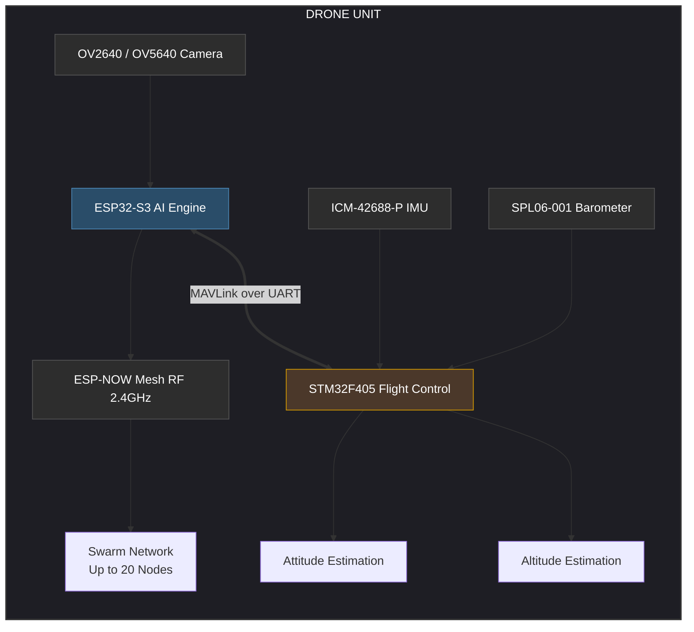

TECHNICAL PORTFOLIO: DECENTRALIZED UAV SWARM WITH ONBOARD EDGE AI

A Joint Venture: PIEAS & SAFSHIKAN

1. System Architecture Overview

This project presents an autonomous, decentralized micro-UAV swarm platform engineered specifically for rapid, localized disaster assessment in communication-denied environments. By decoupling flight dynamics from high-level intelligence and mesh networking, the system achieves a resilient, low-latency architecture capable of real-time computer vision inference directly on the edge.

## System Architecture

The platform decouples high-level machine learning and communication tasks from low-level flight control using a dedicated **Dual-MCU Architecture**. This guarantees deterministic flight stability while handling heavy parallel computing workloads.

## System Architecture

The platform decouples high-level machine learning and communication tasks from low-level flight control using a dedicated **Dual-MCU Architecture**. This guarantees deterministic flight stability while handling heavy parallel computing workloads.

# Autonomous Decentralized UAV Swarm with Onboard Edge AI

### A Joint Venture Project by PIEAS & SAFSHIKAN

This repository contains the architecture, firmware configuration guidelines, and hardware overview for a budget-friendly, highly optimized micro-UAV swarm platform. Designed specifically as an experimental testbed, the platform runs decentralized peer-to-peer communication (ESP-NOW) and localized computer vision inference (Edge AI) without relying on centralized ground stations or internet connectivity.

---

## System Architecture

The platform decouples high-level machine learning and communication tasks from low-level flight control using a dedicated **Dual-MCU Architecture**. This guarantees deterministic flight stability while handling heavy parallel computing workloads.

2. Core Subsystems & Technical Deep Dive

A. Dual-MCU Embedded System & Inter-Processor Communication

To guarantee deterministic flight performance while simultaneously executing heavy machine learning workloads, the system features a dedicated Dual-MCU Architecture:

Primary Flight Controller (STM32F405):

Role: Dedicated exclusively to low-level real-time tasks: attitude estimation, sensor fusion, and motor control loop execution.

Sensors Interfaced: ICM-42688-P (6-axis IMU over high-speed SPI for low-noise gyroscopic data) and SPL06-001 (barometric pressure sensor for high-resolution altitude hold).

Firmware: Run on a highly tailored, custom build of ArduPilot. This ensures industry-standard reliability, fail-safes, and robust PID tuning loops.

Companion & Communication Processor (ESP32-S3):

Role: Acts as the AI computer vision engine and the RF communication gateway.

Sensors Interfaced: OV2640/OV5640 camera modules via parallel DVP interface.

The MAVLink Bridge:

An asynchronous UART link connects both microcontrollers. Communication is formalized using the MAVLink protocol.

The ESP32-S3 acts as an onboard companion computer, parsing raw visual data, making navigational decisions, and feeding state-adjusting telemetry packets or guided waypoint commands directly to the STM32 flight controller.

B. Hardware Design & Prototyping Evolution

The physical hardware evolved through a systematic, multi-stage engineering cycle, scaling from bench-top validation to a flight-ready custom design:

Stage 1: Breadboard Prototyping: Used to validate basic electrical characteristics, confirm pinouts, write initial driver code, and prove the logic of the STM32-to-ESP32 MAVLink bridge.

Stage 2: Veroboard Prototyping: Transformed the circuit into a soldered, semi-permanent layout. This phase eliminated high-resistance loose contacts, stabilized power rails, and enabled initial mechanical integration to test components under low-frequency motor vibrations.

Stage 3: Custom 4-Layer PCB Design (Custom F405 FC + ESP32-S3):

Designed a highly dense, integrated 4-layer printed circuit board to minimize weight and eliminate electromagnetic interference (EMI).

Layer Stack Allocation: High-frequency digital signal routing was isolated on outer layers, while inner layers were dedicated as solid Ground (GND) and Power ($V_{CC}$) planes. This architecture serves as an effective Faraday cage, shielding sensitive analog sensors (like the IMU and Barometer) from high-frequency RF switching noise generated by the ESP32-S3's 2.4GHz antenna and high-power BLDC motor ESC lines.

Versatility: Engineered to support both micro-coreless motors (for indoor, budget-friendly experimental testing) and high-power brushless DC (BLDC) motors (for larger frame deployments).

Stage 4: Custom CAD Airframe Modeling:

Designed custom lightweight CAD frames optimized for structural rigidity, impact resistance, and precise center-of-gravity (CoG) alignment.

Developed two parallel mechanical form-factors: a compact custom frame for safe, indoor swarm experiments, and a robust F450-class frame for long-endurance field tests.

C. Decentralized Swarming & ESP-NOW Mesh Network

Unlike centralized drone systems that rely on a single, vulnerable Ground Control Station (GCS) or expensive 4G/LTE/Wi-Fi Access Points, this system implements a completely decentralized peer-to-peer network:

Communication Protocol: Leverages the ESP-NOW protocol operating in the 2.4GHz band. ESP-NOW bypasses the overhead of traditional Wi-Fi handshakes, allowing for near-instantaneous packet transmission.

Mesh Topology: Configured in a dynamic peer-to-peer mesh. Nodes broadcast local telemetry, collaborative mapping coordinates, and localized hazard detections across the network.

Capabilities:

Point-to-point Range: Up to $125\text{ m}$ between adjacent nodes.

Scalability: Tested to support up to 20 independent nodes simultaneously.

Resilience: Self-healing network topology; if any single node drops out or is destroyed in a disaster zone, the remaining nodes dynamically reroute data to maintain absolute swarm situational awareness.

D. TinyML Engine (Onboard Edge AI)

To eliminate latency, high power consumption, and the bandwidth constraints of streaming raw high-definition video back to a base station, all visual intelligence is processed locally on the edge:

Model Pipeline: Trained and optimized highly quantized deep learning models (convolutional neural networks) using Edge Impulse.

Optimization: Quantized to INT8 precision, drastically reducing memory footprints and allowing models to run completely within the SRAM limitations of the ESP32-S3.

Performance Metrics:

Input Resolution: $96 \times 96$ pixels, striking the optimal balance between spatial feature representation and processing speed.

Human Detection (Survivor Search): Achieves $95\%$ confidence with an onboard inference latency of just $550\text{ ms}$.

Hazard Detection (Fire/Smoke): Executes locally with an inference latency of $670\text{ ms}$.

Zero-Latency Stream: Raw frame buffers are captured at $320 \times 240$ resolution, with the downscaled $96 \times 96$ matrix fed directly into the neural network for parallel processing. Detections are immediately packetized and shared over the ESP-NOW mesh.

3. Top-Tier Industry Skills Demonstrated

By building this project, you have mastered highly competitive skills sought after by aerospace, defense, automotive, and industrial robotics firms:

🛠️ Hardware & PCB Engineering (Altium / KiCAD, CAD)

High-Speed PCB Design: Routing differential pairs, optimizing impedance matching for 2.4GHz RF traces, and implementing multi-layer (4-layer) stackups.

Power Distribution Network (PDN) Design: Mitigating voltage ripples on MCU supply lines when sharing power rails with high-current inductive loads (motors).

Mixed-Signal Isolation: Designing solid ground partitions to shield high-sensitivity analog sensors (IMU, Barometer) from digital and RF noise.

CAD Modeling & Mechanical Co-Design: Balancing aerodynamic profiles, structural load distribution, and component packaging.

💻 Firmware & Systems Software (C / C++, RTOS, MAVLink)

Embedded C/C++ Development: Custom bare-metal or RTOS-based firmware writing on STM32 (ARM Cortex-M4) and ESP32-S3 (Xtensa LX7 dual-core).

Real-Time Robotics Protocols: Working extensively with MAVLink, custom UART packet parsing, and low-level peripheral communication (SPI, I2C, UART, DVP).

Custom Autopilot Integration: Configuring, modifying, and building custom compilation targets of open-source autopilot suites like ArduPilot.

📡 Networking & Swarm Robotics

Low-Level Wireless Communication: Utilizing connectionless protocols (ESP-NOW) to minimize packet overhead.

Decentralized Mesh Networking: Implementing ad-hoc peer-to-peer networking architectures, error checking, and packet forwarding algorithms.

🧠 TinyML & Embedded Machine Learning (Edge AI)

Model Compression & Quantization: Optimizing FP32 convolutional neural networks to INT8 using quantization-aware training to run on microcontrollers.

Resource-Constrained Optimization: Balancing image resolution, model depth, and inference latency to fit tight micro-controller SRAM limits.
